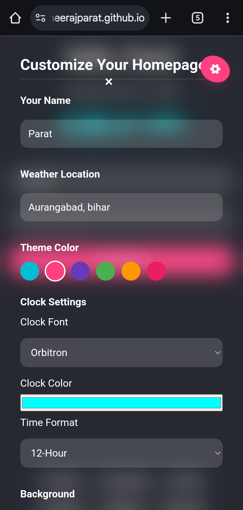
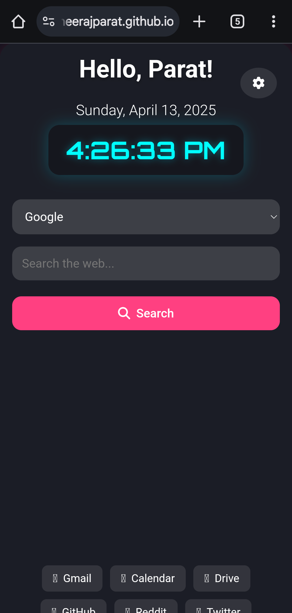
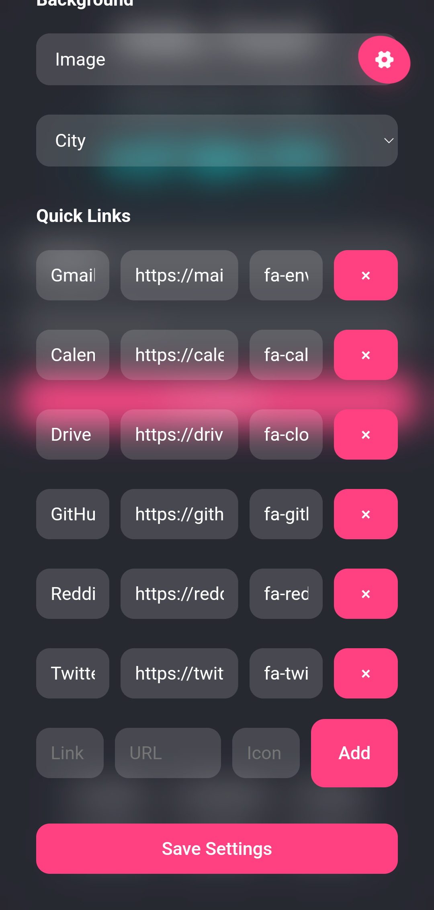
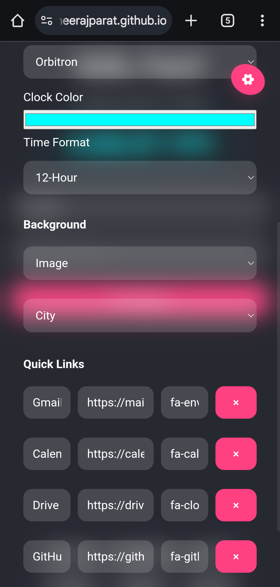

# Custom Homepage

A modern, full-screen, customizable homepage featuring a digital clock, weather widget, search bar with engine selection, and quick links. Built with HTML, CSS, and JavaScript, this project offers a sleek glass-morphic UI with extensive personalization options.

## Features

- **Full-Screen UI**: A responsive, dashboard-style layout that utilizes the entire viewport.
- **Digital Clock**: Displays time in 12/24-hour format with customizable fonts (Orbitron, Roboto Mono, Seven Segment) and colors.
- **Weather Widget**: Shows real-time weather data (temperature, condition, location) using the OpenWeatherMap API.
- **Search Bar**: Supports multiple search engines (Google, Bing, DuckDuckGo, etc.) with icons for each option.
- **Quick Links**: Customizable links with Font Awesome icons for quick access to favorite websites.
- **Settings Panel**: Allows personalization of:
  - Username
  - Theme color
  - Clock settings (font, color, format)
  - Background (solid color, gradient, or image)
  - Weather location (city)
  - Quick links (name, URL, icon)
- **Persistent Storage**: All customizations are saved using `localStorage` for a consistent experience.
- **Icons**: Integrated Font Awesome icons for search engines, quick links, and settings button.
- **Responsive Design**: Adapts seamlessly to various screen sizes, including mobile devices.

## Demo





*(Replace `screenshot.png` with an actual screenshot of your homepage for better visualization.)*

## Prerequisites

- A modern web browser (Chrome, Firefox, Edge, etc.).
- An [OpenWeatherMap API key](https://openweathermap.org) for the weather widget.
- Internet connection for loading Font Awesome, Google Fonts, and API data.

## Setup Instructions

1. **Clone or Download**:
   ```bash
   git clone https://github.com/dheerajparat/Browser-Homepage.git
